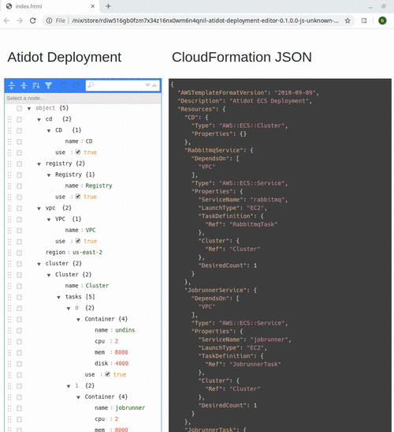

# deployment
Atidot Deployment to AWS (CloudFormation)
# Motivation

- Cloudformation templates are complex error-prone JSONs
- Use a simpler format (`Deployment`) and translate to `Cloudformation`
- Decompose AWS deployment to modular subcomponents
- Compiler checks for `Cloudformation` correctness (even before `awscli` or `EC2 Console`)
- CLI / Editor
~~~
# Build
CLI (Command Line Interface)  
~~~shell
barak@berkos:~/deployment/build (master) $ make
nix-build --cores 0 -I nixpkgs=https://github.com/NixOS/nixpkgs/archive/19.09.tar.gz nix/default.nix
/nix/store/40fn6kv14yhdf6dpabk4mlh3nz83iw07-deployment

barak@berkos:~/deployment/build (master) $ ./result/bin/atidot-deployment 
Missing: COMMAND

Usage: atidot-deployment COMMAND
  Atidot Deployment
~~~
Editor  
~~~shell
barak@berkos:~/deployment/build (master) $ make editor
nix-build --cores 0 -I nixpkgs=https://github.com/NixOS/nixpkgs/archive/19.09.tar.gz -A ghcjs.atidot-deployment-editor nix/editor.nix
/nix/store/l8m8jwkhqd0lc11z8cnwc3avq50n9l8p-atidot-deployment-editor-0.1.0.0-js-unknown-ghcjs
barak@berkos:~/deployment/build (master) $ chromium ./result/bin/atidot-deployment-editor.jsexe/index.html
~~~
# Deploy using `awscli` V2
~~~shell
awscli-chrootenv:barak@berkos:~/deployment/build$ ./result/bin/atidot-deployment example | ./result/bin/atidot-deployment translate > cf.json
awscli-chrootenv:barak@berkos:~/deployment/build$ aws cloudformation create-stack --stack-name atidot-test --template-body file://cf.json --capabilities CAPABILITY_IAM
{
    "StackId": "arn:aws:cloudformation:us-east-1:683395580497:stack/atidot-test/80481d70-6210-11ea-aec6-0e46d57ace87"
}
~~~

# Command Line Interface
Output an example Atidot `Deployment` JSON  
~~~shell
barak@berkos:~/deployment/build (master) $ ./result/bin/atidot-deployment example | jq -c
{"cluster":{"Cluster":{"tasks":[{"use":true,"Container":{"disk":4000,"mem":8000,"name":"undins","cpu":2}},{"use":true,"Container":{"disk":4000,"mem":8000,"name":"jobrunner","cpu":2}},{"use":true,"Container":{"disk":4000,"mem":8000,"name":"api","cpu":2}},{"use":true,"Container":{"disk":4000,"mem":8000,"name":"log-server","cpu":2}},{"use":true,"Container":{"disk":4000,"mem":8000,"name":"rabbitmq","cpu":2}}],"name":"Cluster"},"use":true},"cd":{"use":true,"CD":{"name":"CD"}},"registry":{"use":true,"Registry":{"name":"Registry"}},"vpc":{"use":true,"VPC":{"name":"VPC"}},"region":"us-east-2"}
15:09 barak@berkos:~/Development/atidot/deployment/build (master) $
~~~
Translate an Atidot `Deployment` to Cloudformation Template  
~~~shell
barak@berkos:~/deployment/build (master) $ ./result/bin/atidot-deployment example | ./result/bin/atidot-deployment translate | jq -c
{"AWSTemplateFormatVersion":"2010-09-09","Description":"Atidot ECS Deployment","Resources":{"LogServerTask":{"DependsOn":["VPC"],"Type":"AWS::ECS::TaskDefinition","Properties":{"ContainerDefinitions":[{"Image":{"Fn::Join":["",[{"Ref":"AWS::AccountId"},".dkr.ecr.us-east-2.amazonaws.com/",{"Ref":"Registry"},":","latest"]]},"Memory":8000,"Name":"log-server","Cpu":2}]}},"LogServerService":{"DependsOn":["VPC"],"Type":"AWS::ECS::Service","Properties":{"Cluster":{"Ref":"Cluster"},"DesiredCount":1,"ServiceName":"log-server","LaunchType":"EC2","TaskDefinition":{"Ref":"LogServerTask"}}},"RabbitmqTask":{"DependsOn":["VPC"],"Type":"AWS::ECS::TaskDefinition","Properties":{"ContainerDefinitions":[{"Image":{"Fn::Join":["",[{"Ref":"AWS::AccountId"},".dkr.ecr.us-east-2.amazonaws.com/",{"Ref":"Registry"},":","latest"]]},"Memory":8000,"Name":"rabbitmq","Cpu":2}]}},"Cluster":{"DependsOn":["VPC"],"Type":"AWS::ECS::Cluster","Properties":{}},"JenkinsRole":{"Type":"AWS::IAM::Role","Properties":{"AssumeRolePolicyDocument":{"Statement":[{"Effect":"Allow","Action":"sts:AssumeRole","Principal":{"Service":["ec2.amazonaws.com"]},"Sid":""}]},"Path":"/"}},"ApiTask":{"DependsOn":["VPC"],"Type":"AWS::ECS::TaskDefinition","Properties":{"ContainerDefinitions":[{"Image":{"Fn::Join":["",[{"Ref":"AWS::AccountId"},".dkr.ecr.us-east-2.amazonaws.com/",{"Ref":"Registry"},":","latest"]]},"Memory":8000,"Name":"api","Cpu":2}]}},"Profile":{"Type":"AWS::IAM::InstanceProfile","Properties":{"Roles":[{"Ref":"Ec2Role"}],"Path":"/"}},"RabbitmqService":{"DependsOn":["VPC"],"Type":"AWS::ECS::Service","Properties":{"Cluster":{"Ref":"Cluster"},"DesiredCount":1,"ServiceName":"rabbitmq","LaunchType":"EC2","TaskDefinition":{"Ref":"RabbitmqTask"}}},"CD":{"Type":"AWS::ECS::Cluster","Properties":{}},"JobrunnerService":{"DependsOn":["VPC"],"Type":"AWS::ECS::Service","Properties":{"Cluster":{"Ref":"Cluster"},"DesiredCount":1,"ServiceName":"jobrunner","LaunchType":"EC2","TaskDefinition":{"Ref":"JobrunnerTask"}}},"JobrunnerTask":{"DependsOn":["VPC"],"Type":"AWS::ECS::TaskDefinition","Properties":{"ContainerDefinitions":[{"Image":{"Fn::Join":["",[{"Ref":"AWS::AccountId"},".dkr.ecr.us-east-2.amazonaws.com/",{"Ref":"Registry"},":","latest"]]},"Memory":8000,"Name":"jobrunner","Cpu":2}]}},"VPC":{"Type":"AWS::EC2::VPC","Properties":{"CidrBlock":"10.0.0.0/24"}},"Registry":{"Type":"AWS::ECR::Repository","Properties":{"RepositoryPolicyText":{"Statement":[{"Effect":"Allow","Action":["ecr:GetDownloadUrlForLayer","ecr:BatchGetImage","ecr:BatchCheckLayerAvailability","ecr:PutImage","ecr:InitiateLayerUpload","ecr:UploadLayerPart","ecr:CompleteLayerUpload"],"Principal":{"AWS":[{"Fn::Join":["",["arn:aws:iam::",{"Ref":"AWS::AccountId"},":user/","atidot"]]}]},"Sid":"AllowPushPull"}],"Version":"2008-10-17"},"RepositoryName":"registry"}},"ApiService":{"DependsOn":["VPC"],"Type":"AWS::ECS::Service","Properties":{"Cluster":{"Ref":"Cluster"},"DesiredCount":1,"ServiceName":"api","LaunchType":"EC2","TaskDefinition":{"Ref":"ApiTask"}}},"Ec2Role":{"Type":"AWS::IAM::Role","Properties":{"AssumeRolePolicyDocument":{"Statement":[{"Effect":"Allow","Action":["sts:AssumeRole"],"Principal":{"Service":["ec2.amazonaws.com"]}}]},"Path":"/","Policies":[{"PolicyDocument":{"Statement":[{"Effect":"Allow","Action":["ecs:CreateCluster","ecs:RegisterContainerInstance","ecs:DeregisterConta
~~~

# Atidot `Deployment`
Example  

~~~shell
15:14 barak@berkos:~/Development/atidot/deployment/build (master) $ ./result/bin/atidot-deployment example
{
    "cluster": {
        "Cluster": {
            "tasks": [
                {
                    "use": true,
                    "Container": {
                        "disk": 4000,
                        "mem": 8000,
                        "name": "undins",
                        "cpu": 2
                    }
                },
                {
                    "use": true,
                    "Container": {
                        "disk": 4000,
                        "mem": 8000,
                        "name": "jobrunner",
                        "cpu": 2
                    }
                },
                {
                    "use": true,
                    "Container": {
                        "disk": 4000,
                        "mem": 8000,
                        "name": "api",
                        "cpu": 2
                    }
                },
                {
                    "use": true,
                    "Container": {
                        "disk": 4000,
                        "mem": 8000,
                        "name": "log-server",
                        "cpu": 2
                    }
                },
                {
                    "use": true,
                    "Container": {
                        "disk": 4000,
                        "mem": 8000,
                        "name": "rabbitmq",
                        "cpu": 2
                    }
                }
            ],
            "name": "Cluster"
        },
        "use": true
    },
    "cd": {
        "use": true,
        "CD": {
            "name": "CD"
        }
    },
    "registry": {
        "use": true,
        "Registry": {
            "name": "Registry"
        }
    },
    "vpc": {
        "use": true,
        "VPC": {
            "name": "VPC"
        }
    },
    "region": "us-east-2"
}
~~~
Purpose of `use`  
- Should this part of `Deployment` be used in translating to Cloudformation?
~~~shell
barak@berkos:~/deployment/build (master) $ echo '{"region": "us-east-1", "cluster": {"use": false, "Cluster":{"name": "myCluster", "tasks":[]}}}' | ./result/bin/atidot-deployment translate | jq .Resources.myCluster
null
barak@berkos:~/deployment/build (master) $ echo '{"region": "us-east-1", "cluster": {"use": true, "Cluster":{"name": "myCluster", "tasks":[]}}}' | ./result/bin/atidot-deployment translate | jq .Resources.myCluster 
{
  "DependsOn": [
    "VPC"
  ],
  "Type": "AWS::ECS::Cluster",
  "Properties": {}
}
barak@berkos:~/deployment/build (master) $ 
~~~
# Editor
- http://104.40.92.122/

